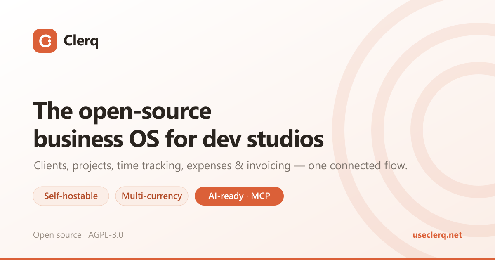
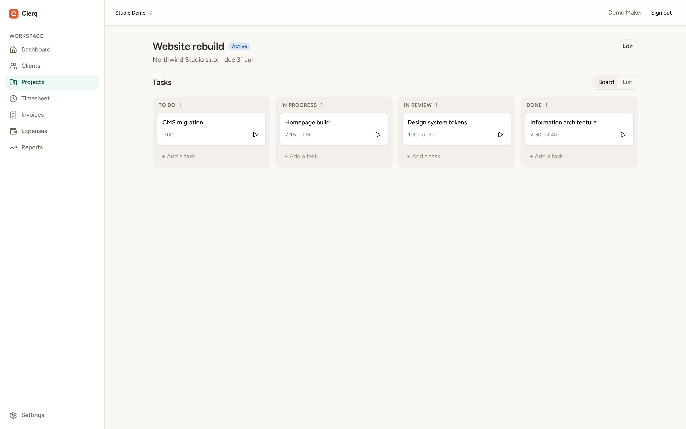
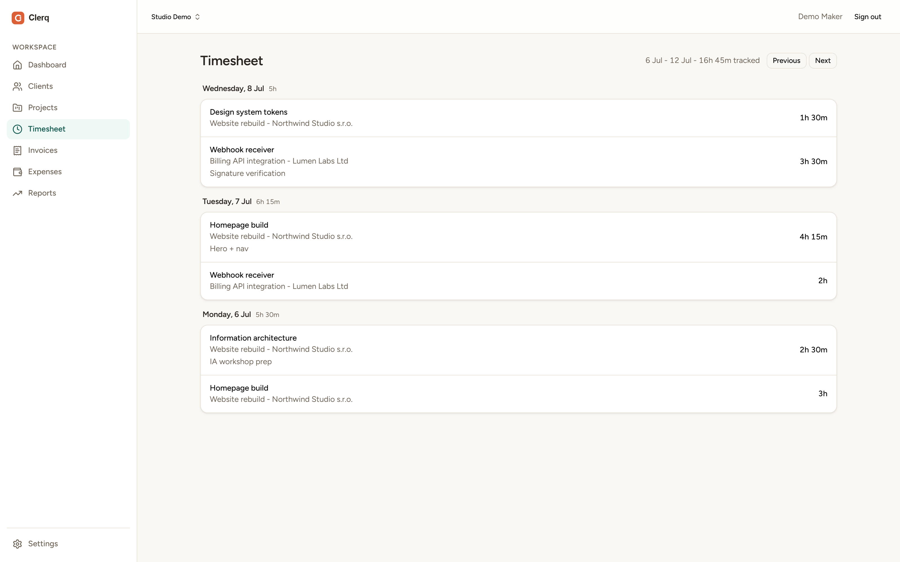
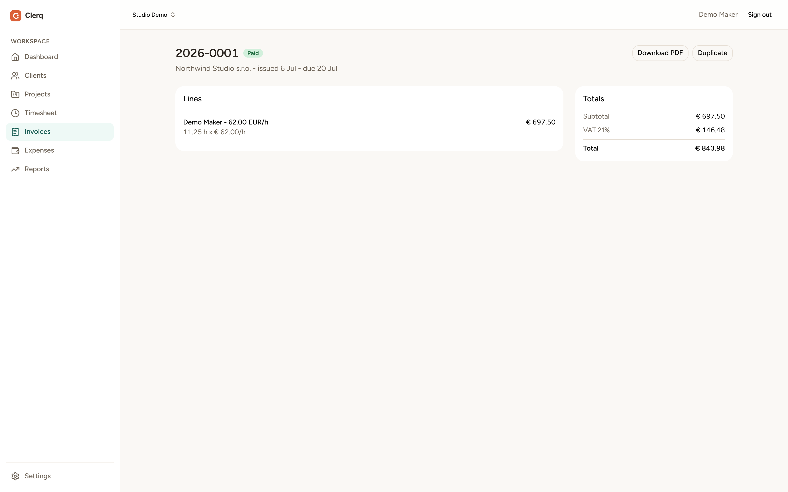
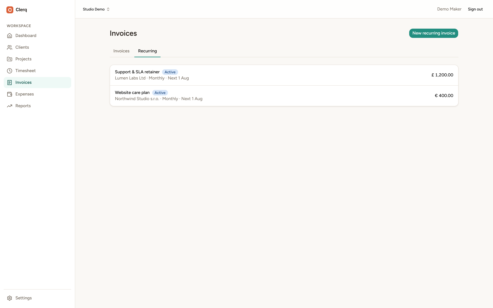

<div align="center">



# Clerq

An open-source, self-hostable business operating system for
developer-freelancers and small dev studios: clients, projects, time
tracking, expenses and invoicing in one connected flow.

**[Use it live →](https://app.useclerq.net)** &nbsp;·&nbsp;
[Website](https://useclerq.net) &nbsp;·&nbsp;
[Documentation](https://useclerq.net/docs) &nbsp;·&nbsp;
[Self-host](#self-host-one-command)

</div>

## Try it

- **Hosted:** sign up at **[app.useclerq.net](https://app.useclerq.net)**, no
  install, use it in your browser.
- **Self-hosted:** one `docker compose up` (see [below](#self-host-one-command)).

## Features

- **Clients** with contacts, default rates, VAT numbers and an activity thread
- **Projects and tasks** with a kanban board and list views
- **Time tracking:** start/stop timers, manual entries, and a weekly timesheet
- **Invoicing:** generate lines from unbilled time (grouped your way) or add
  fixed amounts; multi-currency with ECB conversion fixed per line;
  standard / zero-rated / reverse-charge VAT; gapless per-year numbering;
  draft / sent / paid / overdue lifecycle; branded PDF export
- **Recurring invoices (retainers):** set a schedule once: client, tax
  treatment and fixed-amount lines on a cadence (weekly through yearly, every
  _N_ periods) with net terms and an optional end date or occurrence cap. Clerq
  drafts each invoice when it comes due and either leaves it for review or
  auto-issues it; pause and resume any time. A built-in scheduler runs the
  sweep, with an optional token-guarded `/api/cron/run` for external cron
- **Expenses:** capture expenses and attach them to projects
- **AI & MCP:** an embedded [Model Context Protocol](#ai--mcp) server lets AI
  assistants run your business through the same rules as the web app
- **Provably-correct money math:** every billing rule is fixture-tested with
  hand-verified expected output, using minor-unit integer arithmetic so floats
  never touch money
- **Teams and roles:** small-team memberships with roles and permissions,
  everything scoped per business
- **Multiple businesses per account:** one login can own and belong to several
  businesses, with a topbar switcher to move between them - clean separation,
  no second account needed
- **CSV import** with interactive column mapping for migrating clients in
- **Auth:** email/password (Better Auth), optional Google SSO via env config,
  server-side database sessions
- **One-command self-host** via docker-compose, demo seed included

## Screenshots

> Captured from the built-in demo data (`pnpm db:seed`). See
> [`docs/screenshots`](docs/screenshots) to regenerate them.

<table>
  <tr>
    <td width="50%"></td>
    <td width="50%"></td>
  </tr>
  <tr>
    <td width="50%"></td>
    <td width="50%"></td>
  </tr>
</table>

## AI & MCP

Clerq ships an embedded **[Model Context Protocol](https://modelcontextprotocol.io)**
server, so AI assistants (Claude, or any MCP client) can run your business
data directly, under the same permissions and per-business boundary as the web
app.

- **50+ tools** spanning clients (with contacts, notes and per-member rates),
  projects, tasks, time tracking, invoicing, expenses, profit reporting and
  team management.
- **Every tool wraps the same tRPC layer the UI uses**, so validation and the
  per-business tenancy boundary are identical; an assistant never gets a side
  door into your data.
- **OAuth 2.1 authorization** (via Better Auth) with a consent screen, so you
  can connect a client without minting or pasting long-lived tokens.
- **Signed, short-lived invoice PDF links**, so an assistant can hand you a
  downloadable invoice without a browser login.
- Served at `/api/mcp` inside the app, with nothing extra to deploy.

Point any MCP client at your instance:

```
https://app.useclerq.net/api/mcp     # hosted
https://<your-instance>/api/mcp      # self-hosted
```

**AI receipt scanning (optional):** set an `OPENROUTER_API_KEY` to add a “Scan
with AI” button on the expense form that reads an uploaded receipt (PNG, JPEG
or PDF) and pre-fills the fields. It stays hidden unless configured; see
`.env.example`.

See the [AI docs](https://useclerq.net/docs) for the full tool list and
client-setup walkthrough.

## Self-host (one command)

Requires Docker.

```bash
git clone https://github.com/PunterDigital/clerq.git
cd clerq
docker compose up
```

This starts Postgres, applies database migrations, and serves the app on
[http://localhost:3000](http://localhost:3000). Defaults are fine for
trying it locally; set `POSTGRES_PASSWORD` (see `.env.example`) before
exposing it anywhere.

### Make yourself a platform admin

The System Administration area (cross-tenant stats and moderation) requires an
existing platform admin, which the first sign-up cannot be. Create your account
in the app, then bootstrap yourself from the running container:

```bash
docker compose exec app node grant-admin.mjs you@example.com
```

It's idempotent, so re-running is harmless. Once you're in, grant any other
admins from System Administration → Users. (Contributors running from a source
checkout can use `pnpm admin:grant <email>` instead.)

## Local development

Requires Node 24+, pnpm 10+, and a Postgres instance (or use
`docker compose up postgres`).

```bash
pnpm install
cp .env.example .env   # point DATABASE_URL at your Postgres
pnpm db:migrate
pnpm db:seed           # optional demo data (demo@clerq.local / clerq-demo)
pnpm dev
```

Quality gate (all must pass before any commit):

```bash
pnpm typecheck
pnpm lint
pnpm test
pnpm test:billing
pnpm build
```

See [CONTRIBUTING.md](CONTRIBUTING.md) for repo layout and conventions.

## Licence

[AGPL-3.0](LICENSE). You can self-host, modify, and redistribute freely;
if you run a modified version as a network service, you must offer its
source to your users. Chosen so the project stays genuinely open.
